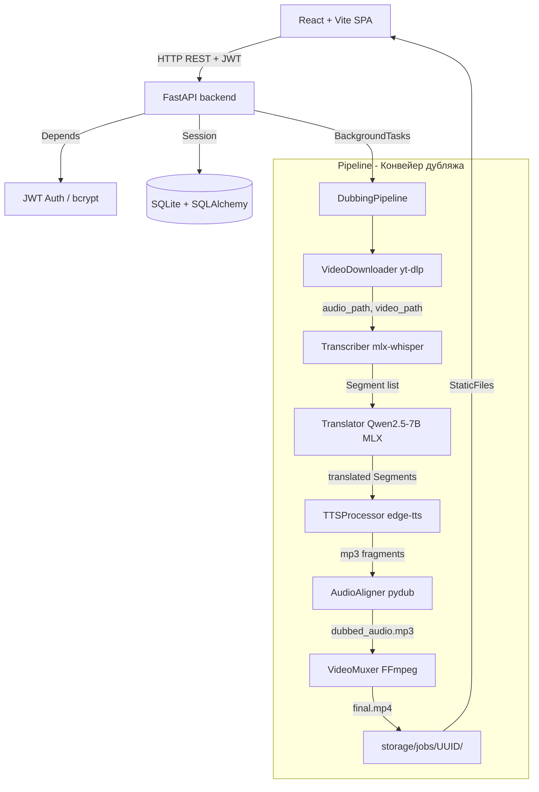
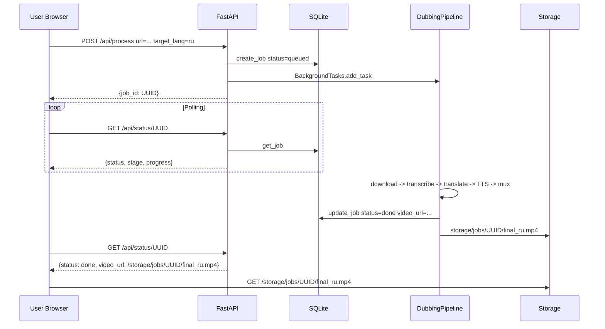

# VOXsync — Анализ архитектуры и обоснование выбора технологий

## 1. Общий обзор

**VOXsync** — это сервис автоматического дубляжа видео. Он принимает ссылку на видео, скачивает его, транскрибирует речь, переводит текст, синтезирует новую озвучку и собирает итоговый файл.

---

## 2. Архитектурная диаграмма



---

## 3. Слои архитектуры

### 3.1. Транспортный слой — **FastAPI** (`src/api/main.py`)

**FastAPI** — асинхронный Python-фреймворк на базе Starlette + Pydantic.

| Используемая возможность | Где используется |
|---|---|
| `BackgroundTasks` | Запуск пайплайна без блокировки HTTP-ответа |
| `Depends()` | DI для БД-сессий и аутентификации |
| `lifespan` context | Инициализация БД при старте |
| `StaticFiles.mount` | Раздача готовых видео из `storage/` |
| SPA catch-all роут | React Router работает без 404 |
| `async def` эндпоинты | Нативный asyncio без WSGI |

**Почему FastAPI, а не Django/Flask?**

- `Flask` — синхронный, нет встроенного DI, нет async из коробки. Для фоновых задач потребовался бы сторонний планировщик.
- `Django` — монолитный фреймворк с ORM, templating, admin — избыточен для JSON API.
- `FastAPI` — минималистичный, полностью асинхронный, с автоматической документацией (OpenAPI), нативным DI и встроенными `BackgroundTasks`. Идеален для ML-сервисов, где часть операций тяжёлая и должна выполняться асинхронно.

---

### 3.2. Слой аутентификации (`src/api/auth.py`)

| Компонент | Решение |
|---|---|
| Хэширование паролей | `bcrypt` |
| Токены | `JWT` (HS256, TTL 7 дней) |
| Передача токена | Bearer header (OAuth2PasswordBearer) |
| Dependency FastAPI | `get_current_user` через `Depends` |

JWT не требует серверного хранилища сессий — токен самодостаточен. Это упрощает горизонтальное масштабирование.

---

### 3.3. Слой данных (`src/database/`)

| Компонент | Решение |
|---|---|
| ORM | **SQLAlchemy** (DeclarativeBase) |
| БД | **SQLite** (файл `voxsync.db`) |
| Сессия | `SessionLocal`, генератор-зависимость `get_db` |

Модели: `User` (email, hashed_password) и `Job` (UUID, статус, прогресс, TTL, URL файлов).

**Почему SQLite?**
- Нет накладных расходов на отдельный процесс БД
- Подходит для одиночного развёртывания
- Легко заменить на PostgreSQL сменой `DATABASE_URL` — SQLAlchemy абстрагирует диалект

---

### 3.4. Конвейер дубляжа (`src/pipeline.py`, `src/core/`)

Класс `DubbingPipeline` — **синглтон с ленивой инициализацией**, содержащий 5 компонентов:

```
DubbingPipeline
├── VideoDownloader     (yt-dlp)
├── Transcriber         (mlx-whisper / Whisper large-v3)
├── Translator          (Qwen2.5-7B-Instruct-4bit via mlx-lm)
├── TTSProcessor        (edge-tts async)
└── VideoMuxer          (FFmpeg subprocess)
```

#### Ключевые дизайн-решения пайплайна:

**1. Ленивая инициализация + кэш модели в памяти**
```python
# src/api/main.py:59
def get_pipeline() -> DubbingPipeline:
    global pipeline
    if pipeline is None:
        pipeline = DubbingPipeline()
    return pipeline
```
LLM-модель (4 ГБ) загружается один раз при первом запросе и живёт в RAM всё время работы сервера.

**2. Смена языка без перезагрузки модели**
```python
# src/pipeline.py:38-39
self.translator.lang_config = new_lang_config
self.tts.lang_config = new_lang_config
```
Модели Qwen и Whisper остаются в памяти; меняется только конфигурация языка.

**3. Изоляция по UUID**
Каждая задача получает `job_id = UUID4`. Все файлы пишутся в `storage/jobs/{job_id}/`. Исключается конфликт между параллельными задачами.

---

### 3.5. Транскрибация (`src/core/transcriber.py`)

Используется **mlx-whisper** — реализация OpenAI Whisper для Apple Silicon (Metal GPU).

| Модели | HuggingFace-репо |
|---|---|
| tiny / base / small / medium | `mlx-community/whisper-*-mlx` |
| large-v3 | `mlx-community/whisper-large-v3-mlx` |

После транскрибации каждому сегменту определяется **пол спикера** через DSP-анализ с `librosa` — это влияет на выбор голоса TTS.

---

### 3.6. Перевод (`src/core/translator.py`)

Используется **локальная LLM** `Qwen2.5-7B-Instruct-4bit` через `mlx-lm`.

Перевод делается батчами по 10 сегментов с жёстким промптом:
- Вернуть ровно столько же строк, сколько во входе (1:1 тайминг)
- Без пояснений, нумерации, кавычек

**Почему локальная LLM, а не Google Translate / DeepL API?**
- Нет зависимости от внешних API и их лимитов
- Контроль качества перевода через промпт
- Работает офлайн
- Поддержка специфического контекста (субтитры)

---

### 3.7. Синтез речи (`src/core/synthesizer.py`)

Используется **Microsoft Edge TTS** (`edge-tts`) — бесплатный облачный TTS Microsoft.

- Асинхронная генерация (`async def`) каждого сегмента
- Выбор голоса по полу (`male_voice` / `female_voice` из `LanguageConfig`)
- После генерации всех фрагментов — `AudioAligner` собирает дорожку с правильными таймингами через `pydub`

---

### 3.8. Мuksер (`src/core/muxer.py`)

Используется **FFmpeg** через `subprocess.run`. Два режима:

| Режим | Описание |
|---|---|
| `REPLACE` (default) | Заменяет оригинальную аудиодорожку на дубляж |
| `MIX` | Накладывает дубляж поверх оригинала (ducking: оригинал 10%, дубляж 150%) |

Видеопоток копируется без перекодирования (`-c:v copy`), что делает процесс быстрым.

---

### 3.9. Фронтенд (`frontend/`)

**React 19 + TypeScript + Vite** — SPA без внешних роутинг-библиотек (чистый `useState`).

- Собирается в `frontend/dist/`
- FastAPI монтирует `/assets` → `frontend/dist/assets`
- SPA catch-all роут отдаёт `index.html` для всех GET

---

## 4. Поток данных (Data Flow)



---

## 5. Почему именно FastAPI — итоговое обоснование

| Критерий | FastAPI | Flask | Django |
|---|---|---|---|
| Асинхронность (asyncio) | ✅ нативная | ⚠️ доп. расширения | ⚠️ ASGI-надстройка |
| BackgroundTasks без Celery | ✅ встроено | ❌ нет | ❌ нет |
| Dependency Injection | ✅ `Depends()` | ❌ нет | ❌ нет |
| Авто-документация OpenAPI | ✅ | ❌ | ❌ |
| Интеграция с Pydantic | ✅ нативная | ❌ | ❌ |
| Подходит для ML-сервисов | ✅ | ⚠️ | ⚠️ |
| Лёгкость (не монолит) | ✅ | ✅ | ❌ |

FastAPI был выбран потому, что:
1. **Фоновые задачи** дубляжа (скачивание, ML-инференс) по природе асинхронные и долгие — `BackgroundTasks` решает это без Celery/Redis
2. **Dependency Injection** через `Depends` упрощает управление БД-сессиями и аутентификацией
3. **Нативный async** позволяет TTS-генерации идти параллельно (edge-tts использует `asyncio`)
4. Проект — **API-first**: нет нужды в templating, admin-панели, Django ORM
5. **Apple Silicon (MLX)** — Whisper и Qwen работают на Metal GPU, FastAPI не мешает этому, давая чистый Python-async

---

## 6. Технический стек — сводная таблица

| Слой | Технология | Версия / Репо |
|---|---|---|
| API-фреймворк | **FastAPI** + Uvicorn | latest |
| Аутентификация | JWT (python-jose) + bcrypt | HS256 |
| БД | SQLite + SQLAlchemy | файл voxsync.db |
| Настройки | pydantic-settings + .env | — |
| Скачивание видео | yt-dlp | latest |
| Транскрибация | mlx-whisper (Whisper large-v3) | Apple MLX |
| Перевод | Qwen2.5-7B-Instruct-4bit (mlx-lm) | mlx-community |
| TTS | Microsoft Edge TTS (edge-tts) | async |
| Аудио-монтаж | pydub + librosa | DSP-анализ |
| Видео-мuksинг | FFmpeg (subprocess) | системный |
| Фронтенд | React 19 + TypeScript + Vite | — |
| Контейнеризация | Docker + docker-compose | (пустые файлы) |
